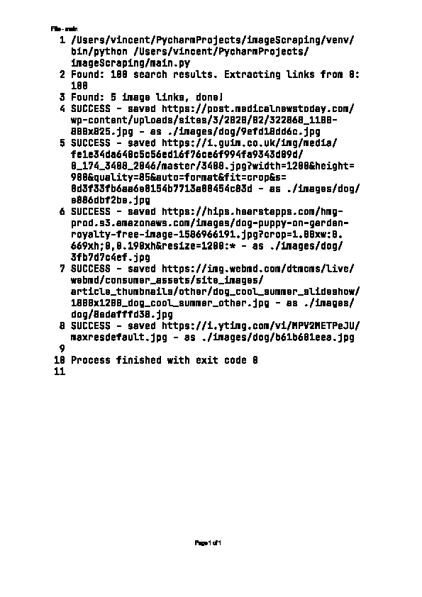

# imageScraping
Image scraping by search_term from Google chrome

1 main.py

call search_and_download
- search_and_download.py
  
    call fetch_image_urls and persist_image
  
- get_image_links_new.py
- persist_image.py

2 webdriver.py

using selenium to work webdriver
  

3 static_scraping.py

using beautifulsoup extract tables